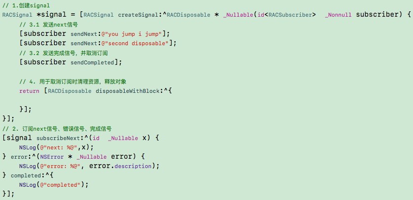
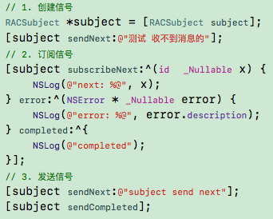
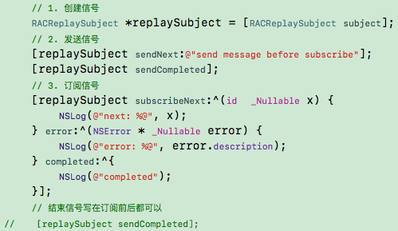
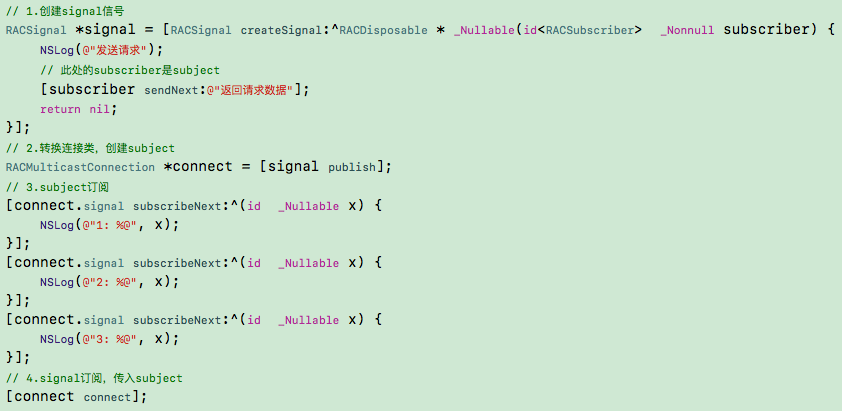
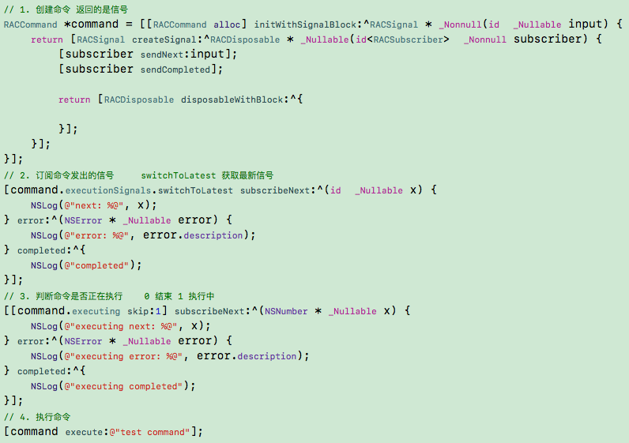
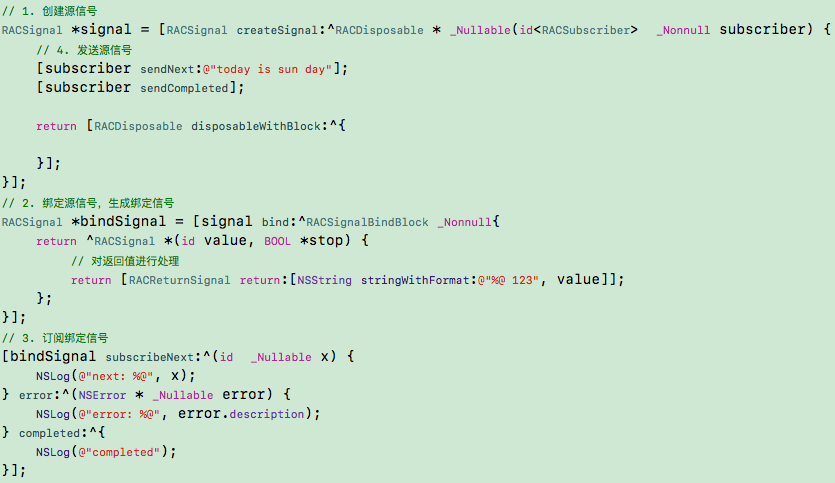

### RACSignal

1. 创建`signal`信号时，先保存传入的`block`;
2. 订阅`signal`信号时，创建订阅者，保存传入的`block`，并且调用创建时保存的`block`;
3. 发送信号时，调用订阅时保存的对应的`block`;
4. 信号结束时，调用取消对应的`block`.

### RACSubject

只能先订阅，后发送消息。

1. 创建`signa`信号时，建立一个`取消管理器(RACCompoundDisposable)`和一个存放`订阅者(RACSubscriber)`的数组;
2. 订阅`signal`信号时，创建订阅者，保存传入的`block`和`订阅者`;
3. 发送信号时，遍历保存`订阅者`的数组，调用订阅时传入的对应`block`;
4. 发送结束信号，调用订阅时传入的完成`block`.

### RACReplaySubject

可以先发送消息，后订阅。

1. 创建`signal`信号时，建立一个存放发送的值的数组，继承自`RACSubject`，也实现了`RACSubject`的第一步;
2. 发送信号时，保存发送的值，调用父类的发送信号，此时还没有订阅者;
3. 订阅`signal`信号时，遍历保存值的数组，如果有值就调用第二步;

### RACMulticastConnection

<<<<<<< HEAD

=======
>>>>>>> master
使用`RACSignal`多次订阅时，会发送多次信号，如果是用于网络请求则不适用，因此使用`RACMulticastConnection`这个连接类代替。

1. 创建`signal`，同`RACSignal`;
2. 创建了一个`RACSubject`信号，把`signal`信号转换成一个连接类，并保存了`RACSignal`和`RACSubject`信号;
3. 使用`RACSubject`信号订阅，多次订阅的是`subject`信号;
4. 使用`RACSignal`订阅时传入的是`subject`信号，因此`signal`信号只订阅了一次，此时会调用第一步保存的`block`，然后是`subject`发送信号，再调用`subject`订阅保存的`block`.

### RACCommand

1. 创建命令，保存传入的`block`，创建`executionSignals`和`executing`信号，返回`signal`信号;
2. `command.executionSignals.switchToLatest`获取`signal`信号，订阅;
3. `command.executing`订阅执行信号，`skip`跳过当前信号，默认第一次会输入执行结束的状态;
4. 执行命令，调用第一步传入的`block`，使用第一步创建的`RACSubject`订阅，传入返回的`signal`信号.

### RACSignal bind

